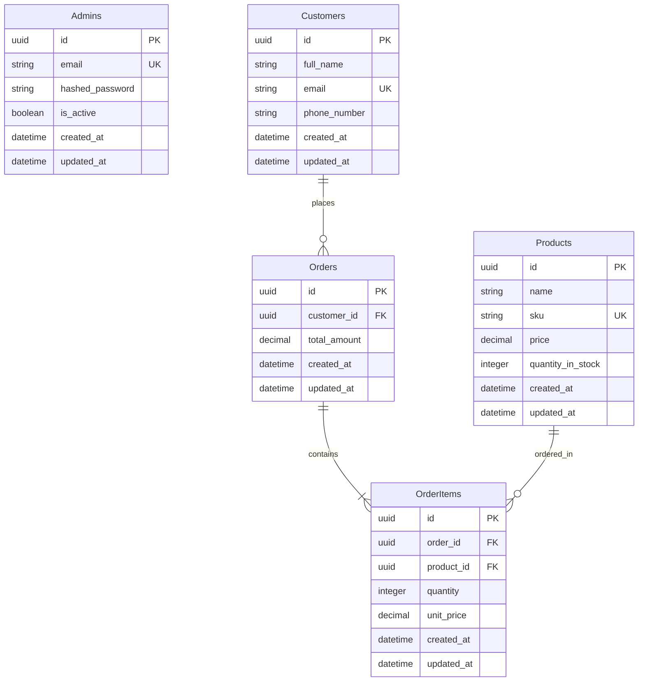

# 📦 Inventrix - Products & Inventory Management System

[](https://inventrix-ruby.vercel.app/)
[](https://fastapi.tiangolo.com/)
[](https://react.dev/)
[](https://www.docker.com/)

**Inventrix** is a premium, state-of-the-art products and inventory management system. It provides businesses and system administrators with a unified, reactive dashboard to track key business metrics, manage products, maintain customer relations, and seamlessly process multi-item sales orders with automated real-time stock updates.

🚀 **Live Deployment:** [https://inventrix-ruby.vercel.app/](https://inventrix-ruby.vercel.app/)

---

## ✨ Features at a Glance

*   **📊 Dynamic Dashboard & Analytics**: Aggregates real-time business statistics:
    *   Total Sales Revenue & Total Orders
    *   Product Stock Valuations & Low Stock Alerts
    *   Interactive lists highlighting recent sales activity
*   **📦 Comprehensive Product Management**: Full CRUD capabilities for tracking inventory items:
    *   Automatic/Custom SKU tracking
    *   Stock levels and pricing thresholds
    *   Smart search filters by Name and SKU
*   **👥 Customer Directory**: Manage contacts, emails, phone records, and their history:
    *   Registering new customers with auto-email validation
    *   Quick-view customer profiles
*   **🧾 Advanced Sales & Order Processing**:
    *   Multi-item orders with live calculations
    *   Real-time stock reduction on order processing
    *   Cascade deletes and relationship linking
*   **🔒 Secure Administrator Authentication**:
    *   Secure password hashing (via `bcrypt` & `passlib`)
    *   Robust JWT token generation for protected administration routes

---

## 🛠️ Technology Stack

| Layer | Technology | Key Libraries |
| :--- | :--- | :--- |
| **Frontend** | React 19 + Vite | React Router DOM 7, Axios, Lucide React, Tailwind CSS |
| **Backend** | FastAPI (Python 3.10+) | SQLAlchemy 2.0 (ORM), Pydantic v2, Alembic, Uvicorn |
| **Database** | PostgreSQL 15 | `asyncpg` (Async Driver) |
| **DevOps** | Docker | Docker Compose |

---

## 📂 Project Architecture & Directory Layout

```
.
├── backend/                       # FastAPI application root
│   ├── app/
│   │   ├── api/                   # API routes (Auth, Products, Customers, Orders, Dashboard, Health)
│   │   ├── core/                  # Configurations, Logging, Security
│   │   ├── db/                    # DB Session and session provider
│   │   ├── models/                # SQLAlchemy database models
│   │   ├── schemas/               # Pydantic validation schemas
│   │   ├── services/              # Business logic layer
│   │   └── main.py                # FastAPI app initialization
│   ├── migrations/                # Alembic database migrations
│   ├── tests/                     # Unit & integration tests
│   ├── Dockerfile                 # Backend container configuration
│   ├── requirements.txt           # Python backend dependencies
│   └── alembic.ini                # Alembic config file
├── frontend/                      # React application root
│   ├── src/
│   │   ├── api/                   # API request wrapper (Axios configs)
│   │   ├── components/            # Reusable UI parts (Inputs, Modals, Cards)
│   │   ├── context/               # AuthContext & state providers
│   │   ├── pages/                 # Full pages (Dashboard, Products, Orders, Customers, Login, Register)
│   │   ├── layouts/               # Admin side navigation and full structures
│   │   ├── index.css              # Styling base (Tailwind config integrations)
│   │   └── main.jsx               # Application entry point
│   ├── Dockerfile                 # Frontend multi-stage build config
│   ├── nginx.conf                 # Production Nginx reverse-proxy router
│   ├── tailwind.config.js         # CSS configurations
│   ├── vercel.json                # Vercel single-page deployment routing
│   └── package.json               # Node.js frontend dependencies
├── docker-compose.yml             # Orchestrates DB, Backend, and Frontend containers
└── .env.example                   # Template for local environment configurations
```

---

## 💾 Database Schema

The database relies on a standard PostgreSQL 15 structure. The relational model is as follows:



---

## ⚡ Quick Start & Deployment Guide

### Option 1: Run with Docker Compose (Recommended)

To run the entire stack (Database, FastAPI Backend, React Frontend) in one command:

1.  **Clone the Repository** and navigate to the project directory.
2.  **Initialize Environment File**:
    ```bash
    cp .env.example .env
    ```
3.  **Start Services**:
    ```bash
    docker-compose up --build
    ```
4.  **Access the applications**:
    *   **Frontend Client**: `http://localhost`
    *   **FastAPI Interactive Docs (Swagger)**: `http://localhost:8000/docs`

---

### Option 2: Manual Local Development

If you prefer to run services manually on your native system:

#### 1. Setup Backend
1. Navigate to backend:
   ```bash
   cd backend
   ```
2. Create and activate a Python virtual environment:
   ```bash
   python -m venv venv
   source venv/bin/activate  # On Windows: venv\Scripts\activate
   ```
3. Install dependencies:
   ```bash
   pip install -r requirements.txt
   ```
4. Setup local PostgreSQL database, then copy configurations into `.env`:
   ```bash
   cp .env.example .env
   # Update DATABASE_URL inside backend/.env
   ```
5. Apply Alembic migrations:
   ```bash
   alembic upgrade head
   ```
6. Start uvicorn development server:
   ```bash
   uvicorn app.main:app --reload --host 127.0.0.1 --port 8000
   ```

#### 2. Setup Frontend
1. Navigate to frontend:
   ```bash
   cd ../frontend
   ```
2. Install npm packages:
   ```bash
   npm install
   ```
3. Create `.env` if custom URLs are needed:
   ```bash
   echo "VITE_API_URL=http://127.0.0.1:8000/api" > .env
   ```
4. Start development web-server:
   ```bash
   npm run dev
   ```
5. Access UI at: `http://localhost:5173/`

---

## 🔌 API Documentation Reference

The backend exposes fully-interactive documentation at `/docs` (Swagger UI) or `/redoc` (ReDoc) when running.

### 🔑 Authentication (`/api/auth`)
*   `POST /api/auth/register` - Registers a new administrator.
*   `POST /api/auth/login` - Authenticates administrator, returns JWT Bearer token.
*   `GET /api/auth/me` - Validates session and returns admin account details.

### 📦 Products (`/api/products`)
*   `GET /api/products/` - Paginated fetch of inventory (supports search parameter).
*   `POST /api/products/` - Creates new inventory item.
*   `GET /api/products/{id}` - Retrieves individual product spec.
*   `PUT /api/products/{id}` - Updates pricing, descriptions, or stock levels.
*   `DELETE /api/products/{id}` - Removes item from tracking index.

### 👥 Customers (`/api/customers`)
*   `GET /api/customers/` - Paginated customer lists with emails and phone numbers.
*   `POST /api/customers/` - Adds new customer profile.
*   `GET /api/customers/{id}` - Retrieves customer details.
*   `PUT /api/customers/{id}` - Updates customer contact information.
*   `DELETE /api/customers/{id}` - Deletes a customer.

### 🧾 Orders (`/api/orders`)
*   `GET /api/orders/` - Paginated listing of sales records and transaction totals.
*   `POST /api/orders/` - Submits a purchase, reduces inventories automatically, calculates prices.
*   `GET /api/orders/{id}` - Obtains purchase particulars and individual line items.
*   `DELETE /api/orders/{id}` - Deletes/Cancels order (restores stock or deletes cascades).

### 📊 Dashboard (`/api/dashboard`)
*   `GET /api/dashboard/summary` - Computes live gross stats, overall net worth, active warning lists, and summaries.

---

## 🚀 Deployment Configs (Vercel & Docker Production)

### Frontend Vercel Configuration (`vercel.json`)
The client app handles routing using the history API. Rewrite instructions are configured to route all deep links to `index.html`:
```json
{
  "rewrites": [{ "source": "/(.*)", "destination": "/index.html" }]
}
```

---

## 📜 License & Acknowledgement

Developed and maintained by **Inventrix Team**. Built with speed, responsiveness, and premium design standards in mind.

Production live demo: **[https://inventrix-ruby.vercel.app/](https://inventrix-ruby.vercel.app/)**
